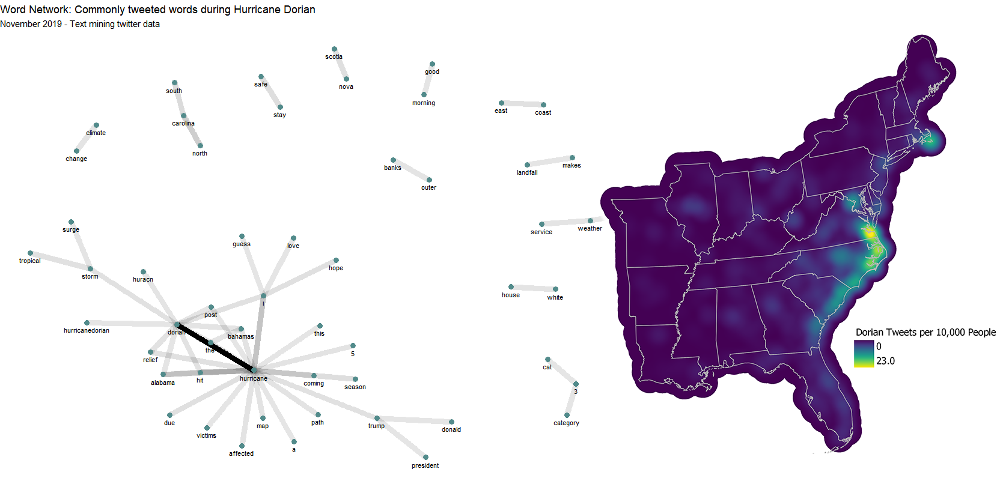
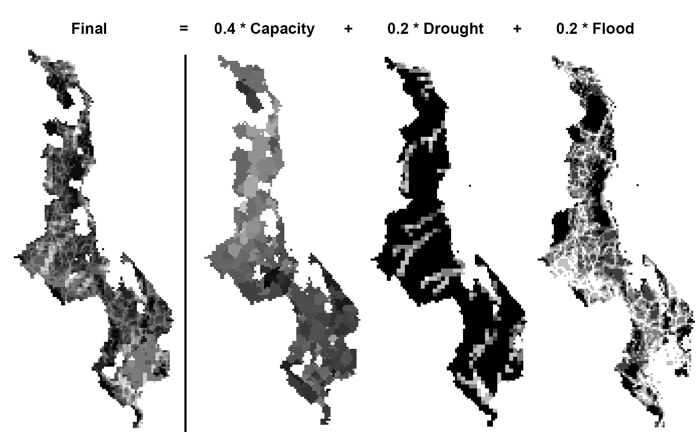

## Portfolio

---

## [Flickr Photo Density Map](/Portfolio/Maps/Flickr)

Using Flickr’s API, I counted every instance of a geotagged photo for each city and mapped them using a dynamic hex-grid choropleth map. Using the bottom slider or the legend’s inputs, you can change the classification of the data, allowing you to see local variation that would be otherwise invisible in a small-scale (i.e. zoomed out) map. Clicking on any location will show you some photos taken there, as well as a link to Google Street View.

** 
QGIS | Mapbox GL JS | Python | Javascript 

---

## [Arizona Border Death Map](/Portfolio/Maps/Arizona-Migration)

      Every year, hundreds of migrants perish at the Southern border as they make their way across the scorching Sonoran desert. Deaths were rare before the Clinton administration, when the border was first militarized with the use of stadium lights, thermal sensors, check points, vehicle barriers and of course, walls. These efforts have been pushing migrants to increasingly dangerous paths, and even though border crossing has decreased significantly over the last two decades, the number of deaths has not.
     This animated map is intended to show the evolving geography of migrant deaths as new patrol stations and border walls are erected. Once the animation is over, a slider will appear that allows you to scroll through time. Zooming in will reveal each victim’s name, age, and location.
QGIS | Mapbox GL JS | Mapbox Studio | Javascript

---

## [Project 3 Title](/Open-Source-GIS/lab9)

Recently, big data has gathered the interest of many, and in the geography community, its use in the study of natural disasters and its potential as a tool for emergency responders are being examined closely. In this lab, the goal is to become familiar with twitter's API through rStudio, and import the geolocated tweets to PostGIS and GeoDa to perform spatial analysis. Specifically, we will examine activity during Hurricane Dorian that devastated the Bahamas and affected the East Coast of the United States. Of course, this event was in part overshadowed by DJT's infamous 'sharpiegate'. By examining twitter activity, I wish to uncover whether such a controversy could alter tweet activity in significant ways to affect emergency responders or academic research.
R Studio | GeoDa | PostGIS/PostgreSQL | QGIS

---

## [Project 3 Title](/Open-Source-GIS/lab8)

This lab has two large goals. Firstly, we will reproduce a vulnerability map published in Applied Geography by Malcolm, Weaver, and Krakowka using the datasets and methodologies outlined in their article. Secondly, we will critique the methods used by the authors and discuss the broader issue of replicability in vulnerability analysis. This lab is an opportunity to dive deep into the reproducibility and replicability discussion that is becoming a hot issue in the social science community.

---

Page template forked from <a href="https://github.com/evanca/quick-portfolio">evanca</a>

<!-- Remove above link if you don't want to attibute -->
