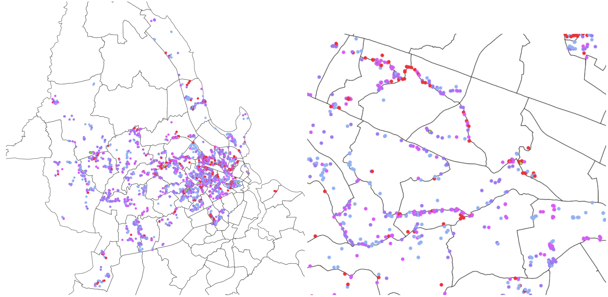
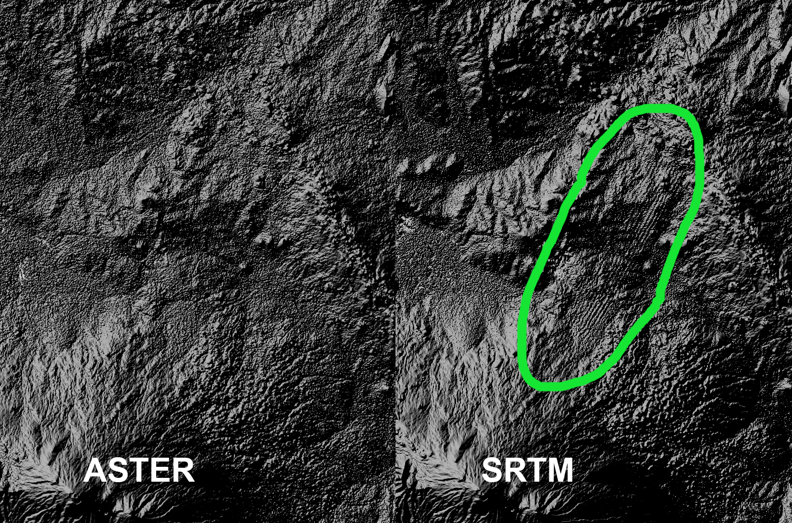
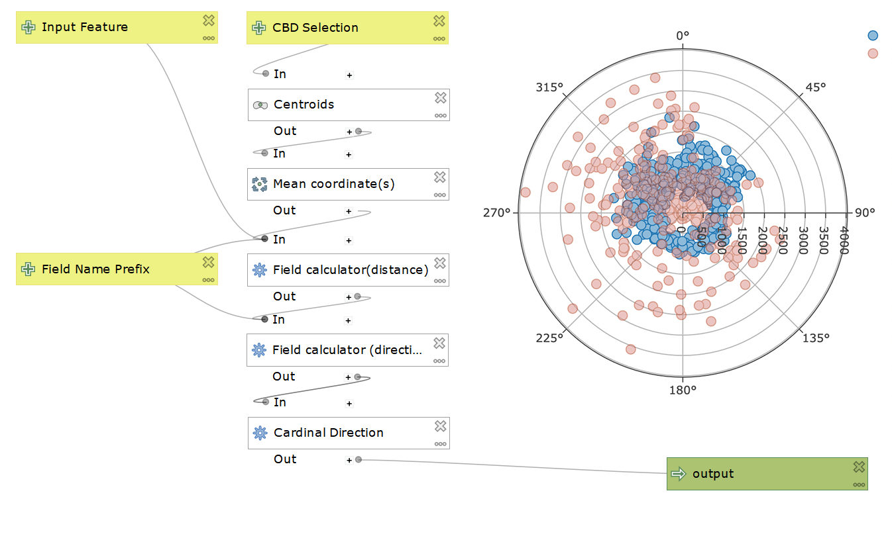

## Webmaps

---

## <a href="/Portfolio/Maps/Flickr" target="_blank">Flickr Photo Density Map</a>
 
Using Flickr’s API, I counted every instance of a geotagged photo in Tokyo and Manhattan and mapped them using a dynamic hex-grid choropleth map. Choropleth maps are used to map everything, from election predictions to Covid cases to the racial make up of a city. However they have a two fundamental flaws that misguide and deceive the reader: 1) large geographic areas carry more visual weight (e.g. a US election map is way more red than blue by area) and 2) classification (numbers at which color breaks happen) <a href='https://kaitlyncoleman22.files.wordpress.com/2015/11/lab66.jpg?w=1424'>can be used to tell completely different stories</a>. My map is possibly the first in the world to fix both of these issues by adding a dynamic classification to a uniform hexagon grid. Check it out!

** 
QGIS | Mapbox GL JS | Python | GeoPandas | Javascript 

---

## <a href="/Portfolio/Maps/Arizona-Migration" target="_blank">Arizona Border Death Map</a>
 
This is an animated map that shows the evolving geography of migrant deaths as new patrol stations and border walls are erected. Even though border crossers have significantly decreased in the past two decades, the number of deaths have not because border patrol have pushed migrants into increasingly remote and dangerous areas.

** 
QGIS | Mapbox GL JS | Mapbox Studio | Javascript 

---

 
 

## GIS projects

---

## <a href="/Open-Source-GIS/lab6" target="_blank">OSM and PostGIS for vulnerability assessment</a>
 
I used OpenStreetMap (OSM) and Tanzania Resilience Academy (RA) data to quantify a dimension of disaster vulnerability, and created a visualization at the sub-ward level to aid policy action. I specifically looked at the vulnerability caused by the build-up of rubbish in areas that are near existing drain blockages, but are inaccessible by vehicle. The geo-analysis was done using PostGIS.

** 
PostGIS/PostgreSQL | QGIS 

---

## <a href="/Open-Source-GIS/lab3" target="_blank">Comparing quality of DEM raster datasets</a>
 
I compared the data quality of two DEM raster datasets, ASTER and SRTM in my study region of Mount Kilimanjaro using a terrain analysis program SAGA. I made sense of the  areas of low resolution in the SRTM data by looking at its metadata (i.e. data provenance) and by considering the data capture method. I also analyzed how this raster error propagates when performing terrain analysis on the problematic regions.

** 
SAGA | QGIS 

---

## <a href="/Open-Source-GIS/lab9" target="_blank">Network, textual, and spatial analysis of Tweets</a>
 
Geotagged tweets can be useful in the study of natural disasters and could potentially be used as a tool for emergency responders. I downloaded geotagged tweets to rStudio through the API to perform network and textual analysis and then used PostGIS and GeoDa to for spatial analysis. Specifically, I examined twitter activity during Hurricane Dorian that devastated the Bahamas and affected the East Coast of the United States.

** 
R Studio | GeoDa | PostGIS/PostgreSQL | QGIS 

---

## <a href="/Open-Source-GIS/lab8" target="_blank">Reproducibility and replicability</a>
 
Reproducibility and replicability are arguably the greatest issues that social science (and natural science) research faces at this moment. In geography, studying reproducibility is complicated since no two places are the same (that's the point of the whole discipline!). However, we can test replicability using the same methods and data that authors use in their research (or can we?). Here, I try to replicate a vulnerability assessment of Malawi and compare my results with the authors'.

** 
PostGIS/PostgreSQL | QGIS 

---

## <a href="/Open-Source-GIS/lab1" target="_blank">Creating open source tool for QGIS</a>
 
As an exercise and introduction to open source GIS, I made a QGIS model with an open source license and a help document. The model was designed to be used in urban geography analysis, specifically for distance-decay analysis that conceptualize the urban space as being organized radially out from the central business district. The tool calculates the distance and direction with respect to the central business district for each polygon in the input shapefile. I tested the model with census data and plotted it using DataPlotly.

** 
DataPlotly | QGIS 

---

Page template forked from <a href="https://github.com/evanca/quick-portfolio">evanca</a>Theme by <a href="https://github.com/orderedlist">orderedlist</a>

<!-- Remove above link if you don't want to attibute -->
